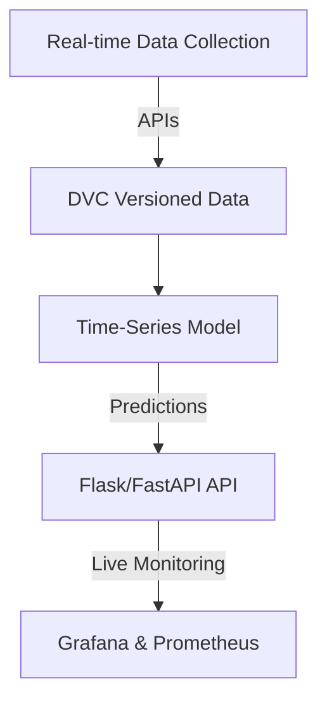

# MLOps Environmental Monitoring & Pollution Prediction System

  
  
  

## 📌 Project Overview  
This project implements an **MLOps pipeline** for monitoring **environmental data** and predicting **pollution trends** using machine learning. The system:  
✅ **Fetches real-time air quality & weather data** from APIs 📡  
✅ **Versions and automates data management** using **DVC** 🔄  
✅ **Develops time-series models** for pollution prediction 📈  
✅ **Deploys a prediction API** using **Flask/FastAPI** 🌐  
✅ **Monitors live system performance** using **Grafana & Prometheus** 📊  

---

## 🏗️ Architecture  

