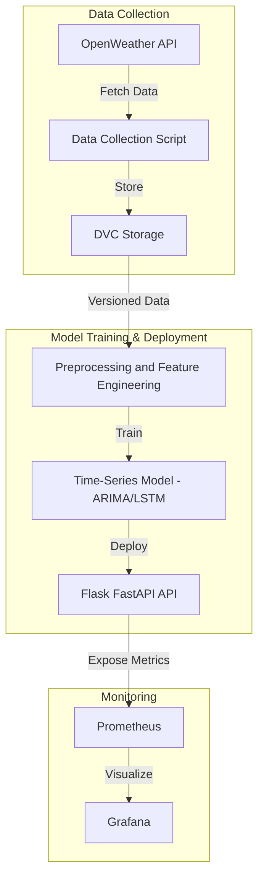

# MLOps Environmental Monitoring & Pollution Prediction System

## Project Overview
This project implements an **MLOps pipeline** for monitoring **air pollution** and predicting **Air Quality Index (AQI)** using machine learning. The system integrates **data collection, model development, deployment, and monitoring** into a streamlined workflow.

### Key Objectives
- Automate **data collection & versioning** using **DVC**
- Develop a **time-series prediction model** (ARIMA/LSTM) for **AQI forecasting**
- Deploy the model as an **API** using **Flask/FastAPI**
- Set up **monitoring & alerting** using **Prometheus & Grafana**
- Perform **live testing** using real-time data from **OpenWeather API**

### Key Tools Used
- **DVC (Data Version Control)** → Tracks & manages datasets via **Amazon S3**
- **Flask/FastAPI** → Serves model predictions as an **API**
- **Prometheus & Grafana** → Monitors model performance & system health

---

## System Architecture

---

## Features Implemented
| Feature               | Description |
|-----------------------|-------------|
| **Data Collection** | Fetches real-time AQI & weather data via OpenWeather API |
| **Automated Scheduling** | **Windows Task Scheduler** executes the batch file every 4 hours for continuous data collection |
| **Data Versioning** | Uses **DVC** with **Amazon S3** for dataset tracking |
| **Model Training** | Develops **ARIMA & LSTM** for AQI forecasting |
| **Model Deployment** | Deploys predictions via **Flask/FastAPI API** |
| **Live Monitoring** | Uses **Grafana & Prometheus** for tracking performance |

---

## System Architecture for Monitoring
- **Flask Application**: Serves the LSTM model for real-time predictions based on live data from OpenWeather API.
- **Prometheus**: Collects and stores metrics exposed by the Flask app’s `/metrics` endpoint.
- **Grafana**: Visualizes Prometheus metrics in customizable dashboards for real-time performance monitoring.
- **Live Data Streams**: Fetch weather and pollution data continuously to feed the prediction pipeline.

This architecture ensures that the Flask API, metrics collection, and visualization tools work seamlessly to provide insights into system behavior.

---

## Workflow
1. **Data Collection**: The system fetches real-time AQI & weather data from **OpenWeather API**. Data collection is automated using **Windows Task Scheduler**, which runs every 4 hours.
2. **Data Preprocessing & Feature Engineering**:
   - Various preprocessing and feature engineering steps were performed, including handling missing values, outlier detection, scaling, and feature extraction. For a detailed breakdown, please refer to the **Project Report** included in the repository.
3. **Data Versioning**: The collected and preprocessed data is stored and tracked using **DVC (Data Version Control)** with **Amazon S3** as remote storage.
4. **Model Development**:
   - Two time-series models were developed: **ARIMA (AutoRegressive Integrated Moving Average)** and **LSTM (Long Short-Term Memory Neural Network)**.
   - **ARIMA** was used for short-term AQI forecasting, while **LSTM** captured long-term dependencies.
   - The best-trained model was selected for deployment. More details on the model evaluation and hyperparameter tuning can be found in the **Project Report**.
5. **Model Deployment**: The trained model is deployed as an API using **Flask/FastAPI**, allowing users to make real-time predictions.
6. **Monitoring & Logging**: The deployed API and model performance are continuously monitored using **Prometheus & Grafana**, providing real-time metrics and visualizations.

---

## API Endpoints
| Method | Endpoint           | Description |
|--------|-------------------|-------------|
| GET    | `/predict`         | Get pollution level prediction |
| POST   | `/predict`         | Send input data for model inference |
| GET    | `/metrics`         | API & model performance metrics |

---

## Challenges & Key Learnings

### Challenges Faced
- Real-time data ingestion while ensuring dataset versioning with DVC
- Optimizing time-series models (ARIMA/LSTM) for air quality forecasting
- Issues with MLflow setup and tracking, including configuration difficulties and experiment logging inconsistencies

### Key Learnings
- Configuring remote storage and using DVC for dataset versioning and tracking
- Automating data pipelines with Windows Task Scheduler for continuous data ingestion
- Deploying ML models as APIs with Flask/FastAPI for real-time inference
- Improving model interpretability and performance tracking through advanced monitoring tools like Prometheus & Grafana 

---

## Future Improvements
- **Enhance MLflow integration** for **experiment tracking and continuous training**  
- **Implement automated hyperparameter tuning** using MLflow  
- Improve LSTM & ARIMA model accuracy through hyperparameter optimization and additional feature engineering
- Expand Grafana & Prometheus setup to track more detailed model performance metrics and enhance dashboard visualization
- Deploy to cloud-based services (AWS, GCP, Azure)
- **Integrate alerting system** for high pollution days  

---

